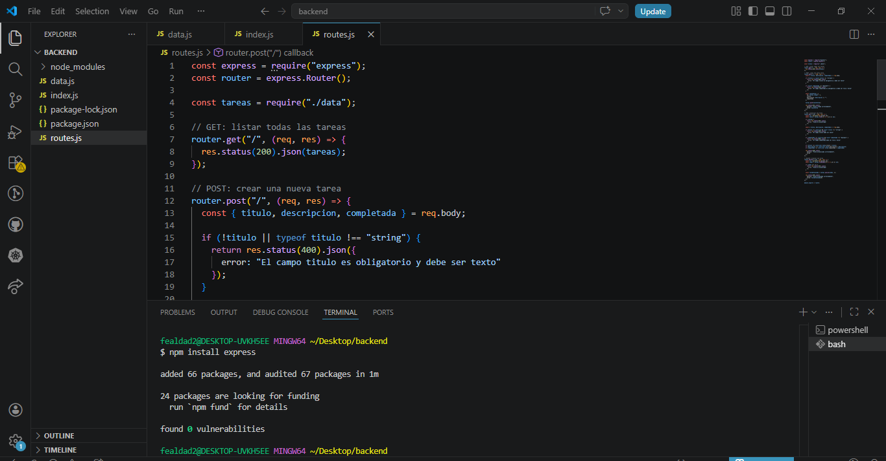
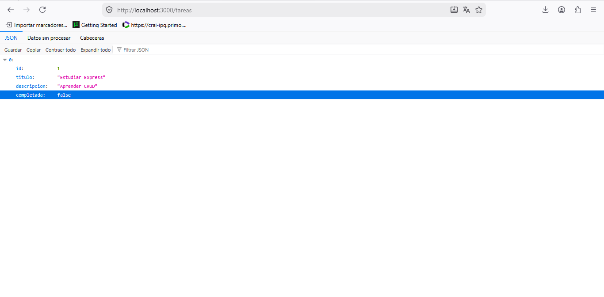
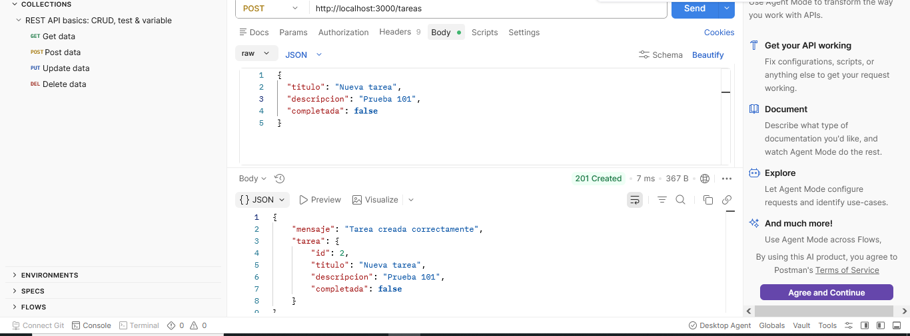
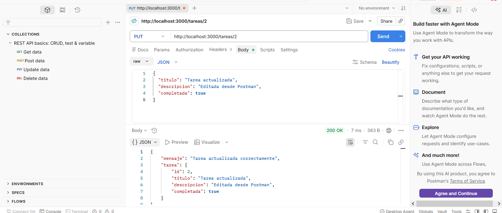
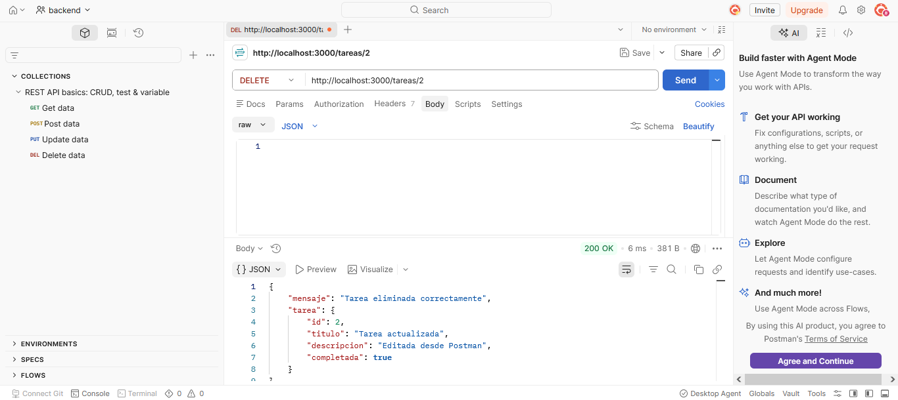
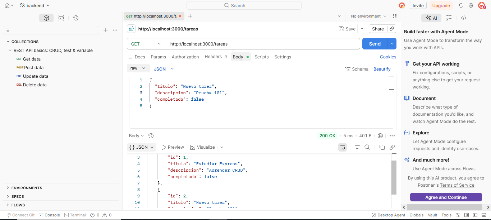
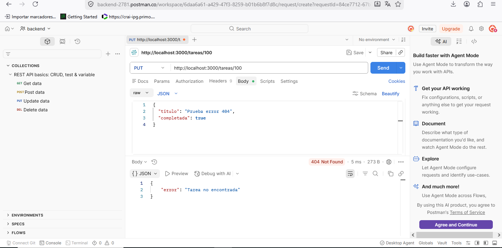
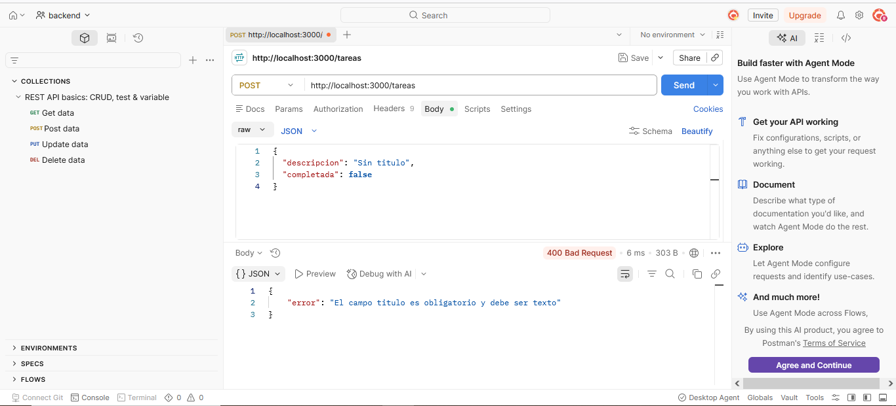

# API de Tareas con Express.js

## Descripción

Este proyecto consiste en una API RESTful sencilla desarrollada con Node.js y Express.js.

La API permite realizar operaciones CRUD sobre una lista de tareas:

- Crear tareas
- Listar tareas
- Actualizar tareas
- Eliminar tareas

Los datos se almacenan en un archivo externo llamado `data.js`, utilizando un array de objetos, sin necesidad de una base de datos.

---

# Tecnologías utilizadas

- Node.js
- Express.js
- JavaScript
- Postman

---

# Instalación

## 1. Clonar el proyecto

```bash
git clone URL_DEL_REPOSITORIO
```

## 2. Entrar a la carpeta

```bash
cd backend
```

## 3. Instalar dependencias

```bash
npm install
```

---

# Ejecutar el servidor

```bash
node index.js
```

Servidor funcionando en:

```bash
http://localhost:3000
```

---

# Endpoints

## GET → Listar tareas

### Petición

```http
GET http://localhost:3000/tareas
```

### Respuesta JSON

```json
[
  {
    "id": 1,
    "titulo": "Estudiar Express",
    "descripcion": "Aprender CRUD",
    "completada": false
  }
]
```

---

## POST → Crear tarea

### Petición

```http
POST http://localhost:3000/tareas
```

### Body JSON

```json
{
  "titulo": "Hacer tarea backend",
  "descripcion": "CRUD con Express",
  "completada": false
}
```

### Respuesta JSON

```json
{
  "mensaje": "Tarea creada correctamente",
  "tarea": {
    "id": 2,
    "titulo": "Hacer tarea backend",
    "descripcion": "CRUD con Express",
    "completada": false
  }
}
```

---

## PUT → Actualizar tarea

### Petición

```http
PUT http://localhost:3000/tareas/2
```

### Body JSON

```json
{
  "titulo": "Tarea actualizada",
  "descripcion": "Editada desde Postman",
  "completada": true
}
```

### Respuesta JSON

```json
{
  "mensaje": "Tarea actualizada correctamente",
  "tarea": {
    "id": 2,
    "titulo": "Tarea actualizada",
    "descripcion": "Editada desde Postman",
    "completada": true
  }
}
```

---

## DELETE → Eliminar tarea

### Petición

```http
DELETE http://localhost:3000/tareas/2
```

### Respuesta JSON

```json
{
  "mensaje": "Tarea eliminada correctamente"
}
```

---

# Validaciones

La API incluye validaciones básicas:

-  El campo `titulo` es obligatorio.
- El campo `completada` debe ser boolean (`true` o `false`).
- Se utilizan códigos HTTP:
* 200 OK
* 201 Created
* 400 Bad Request
* 404 Not Found


# Pruebas

Las pruebas de los endpoints fueron realizadas utilizando Postman.

Se incluyen pantallazos de:

- GET
- POST
- PUT
- DELETE
- Error 400 Bad Request
---

---

# Evidencias de pruebas

## Vista del proyecto en Visual Studio Code



## GET - Listar tareas



## POST - Crear tarea



## PUT - Actualizar tarea



## DELETE - Eliminar tarea



## Código 200 OK



## Código 404 Not Found



## Error 400 Bad Request


